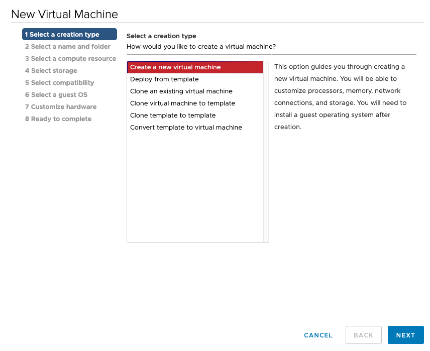

# Disclaimer

This (iPXE) is not a supported by Red Hat., Use it at your own please and risk! iPXE installation is only documented for [Bare metal installations](https://docs.openshift.com/container-platform/latest/installing/installing_bare_metal/installing-bare-metal.html#installation-user-infra-machines-pxe_installing-bare-metal).

PS: This method works just with BIOS

# When DHCP is not a option ? What to do ?

You probably deploy your OCP cluster through with pxe/dhcp or static ips with manual interactions. DHCP is the most convenient way to deploy nodes in an automated Way. But what about having to remotely init a new environement, without DHCP at all ? Suppose that you have a OCP4 cluster that you have to deploy on vSphere, but there is no DHCP environment due to security constraints.

So, I want to show you a simple way to install through ligthweight 1Mb iso image :)

This build option enables support for vSphere GuestInfo settings.


# Install Instructions

## Create a iPXE template virtual machine

Prerequisite: 
 * Upload IPXE.iso to Datastore

### Create an empty Virtual machine:
 1) New Virtual Machine... 
 2) Create a new Virtual machine
    *  
 3) Set Virtual machine name: `rhcos-4-ipxe` & select a location 
    * 
 4) Select a compute resource
 5) Select storage
 6) Select compatibility - ESXi 6.7 and later
 7) Select a guest OS - Linux - Red Hat Enterprise Linux 8 (64-bit)
    * 
 8) **Customize hardware** - very important!
    * 
    * 
    * 
    * 
    * 
    * 
 9) Ready to complete

## Bastion

The easiest way to start experimenting with iPXE is to use the pre-build:
```
curl https://github.com/ralvares/ipxe/releases/download/v0.1/ipxe.iso -o ipxe.iso
```

Or you can build your own:
```
sudo yum install git xz-devel wget -y
sudo yum groupinstall "Development tools" -y

git clone https://github.com/ipxe/ipxe/
cd ipxe/src

sed -i '/VMWARE_SETTINGS/s/\/\///g' config/settings.h

cat > vmware.ipxe << 'EOF'
#!ipxe
ifopen net0
kernel  ${fileserver}/${kernel-installer} ip=${net0/ip}::${net0/gateway}:${net0/netmask}:${hostname}:${net_interface}:none nameserver=${dns} rd.neednet=1 initrd=${fileserver}/${initrd-installer} console=tty0 console=ttyS0 coreos.inst=yes coreos.inst.install_dev=${disk} coreos.inst.image_url=${fileserver}/${rhcos-image} coreos.inst.ignition_url=${fileserver}/${ignition}
initrd ${fileserver}/${initrd-installer}
boot
EOF

make bin/ipxe.iso EMBED=vmware.ipxe
```


## govc Installation
```
curl -L https://github.com/vmware/govmomi/releases/download/v0.22.1/govc_linux_amd64.gz | gunzip > /usr/local/bin/govc && chmod +x /usr/local/bin/govc
```
### govc basic connectivity
Export a set of environment variables so the CLI knows how to connect to vCenter:
```
export GOVC_URL='vsphere.server.local
export GOVC_USERNAME='admin@vsphere.local'
export GOVC_PASSWORD='password
export GOVC_INSECURE=1
export GOVC_NETWORK='VM Network'
export GOVC_DATASTORE='datastore1'
```

### Upload the ipxe.iso to datastore
```
govc datastore.upload bin/ipxe.iso ipxe-rhcos.iso
govc datastore.ls images
```

### The general syntax for a GuestInfo setting is
```
guestinfo.ipxe[.<network device>].<setting name>[.<setting type>] = "<value>"
```

### Create Demo Virtual Machine using vCenter GUI or use ansible to automate it :)

### Set guest.info parameters as follows:
```
guestinfo.ipxe.hostname = "bootstrap"
guestinfo.ipxe.ignition = "bootstrap.ign"
guestinfo.ipxe.net0.ip = "192.168.122.15"
guestinfo.ipxe.net0.netmask = "255.255.255.0"
guestinfo.ipxe.net0.gateway = "192.168.122.1"
guestinfo.ipxe.fileserver = "http://192.168.122.1:8080"
guestinfo.ipxe.dns = "192.168.122.1"
guestinfo.ipxe.kernel-installer = "rhcos-4.2.0-x86_64-installer-kernel"
guestinfo.ipxe.initrd-installer = "rhcos-4.2.0-x86_64-installer-initramfs.img"
guestinfo.ipxe.rhcos-image = "rhcos-4.2.0-x86_64-metal-bios.raw.gz"
guestinfo.ipxe.disk = sda
guestinfo.ipxe.net_interface = ens192
```
### Using govc
```
govc vm.change \
    -e="guestinfo.ipxe.hostname=bootstrap" \
    -e="guestinfo.ipxe.ignition=bootstrap.ign" \
    -e="guestinfo.ipxe.net0.ip=192.168.122.15" \
    -e="guestinfo.ipxe.net0.netmask=255.255.255.0" \
    -e="guestinfo.ipxe.net0.gateway=192.168.122.1" \
    -e="guestinfo.ipxe.fileserver=http://192.168.122.1:8080" \
    -e="guestinfo.ipxe.dns=192.168.122.1" \
    -e="guestinfo.ipxe.kernel-installer=rhcos-4.2.0-x86_64-installer-kernel" \
    -e="guestinfo.ipxe.initrd-installer=rhcos-4.2.0-x86_64-installer-initramfs.img" \
    -e="guestinfo.ipxe.rhcos-image=rhcos-4.2.0-x86_64-metal-bios.raw.gz" \
    -e="guestinfo.ipxe.disk=sda" \
    -e="guestinfo.ipxe.net_interface=ens192" \
    -vm=/${GOVC_DATACENTER}/vm/folder/ipxe-demo
```

Power UP the VM and have fun :)
